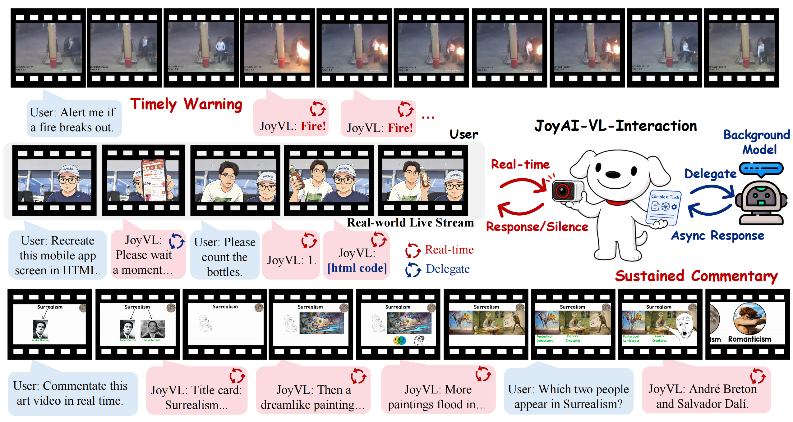
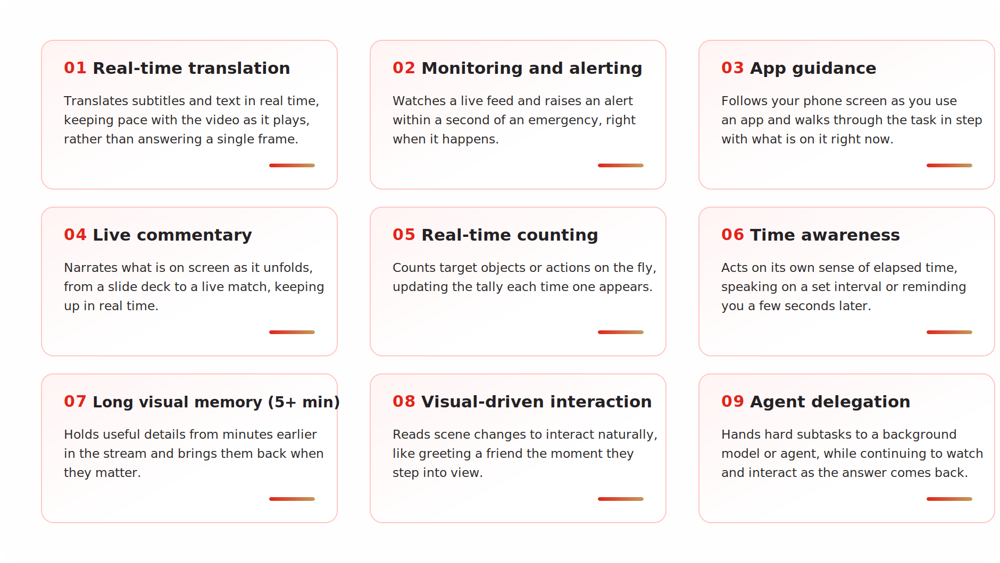
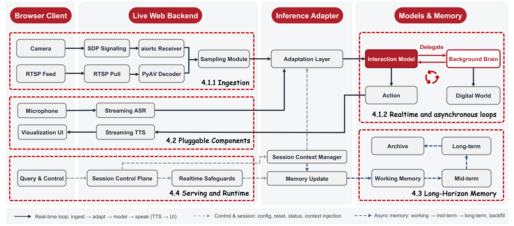

# JoyAI-VL-Interaction

> 🔥 **Full open-source release is coming around June 20, 2026.** The release will include the 8B model, training recipe, time-aligned interaction data, and a complete deployable real-time video-language interaction system.

- 🚀 **Blog**: [JoyAI-VL-Interaction](https://joyai-vl-video-future-academy-jd.github.io/JoyAI-VL-Interaction/)
- 💻 **Code**: [jd-opensource/JoyAI-VL-Interaction](https://github.com/jd-opensource/JoyAI-VL-Interaction)
- 📄 **Technical Report**: [JoyAI-VL-Interaction-Reportv1.pdf](https://github.com/joyai-vl-video-future-academy-jd/JoyAI-VL-Interaction/blob/main/JoyAI-VL-Interaction-Reportv1.pdf)

https://github.com/user-attachments/assets/2853fc95-ad21-4972-8206-5f3d19798b14



## ✨ Introduction

JoyAI-VL-Interaction is an open real-time video-language interaction model. Instead of waiting for a user turn, it stays present in a live visual stream, decides when a moment is worth a response, and acts at the right time.

The model is built around four core ideas:

1. **Real-time presence**: it watches continuously and responds in under a second when needed.
2. **Vision-triggered proactivity**: it speaks from what it sees, while staying quiet when nothing matters.
3. **Agent delegation**: it can hand hard subtasks to a background model, API, or agent while continuing to watch the stream.
4. **Fully open stack**: we release the model, data, training recipe, and deployable system so the work can be reproduced and extended.

## 🧩 Capability

Once interactivity is trained into the model itself, rather than bolted on by an external harness, a whole class of capabilities comes naturally. These are exactly the things a turn-based assistant can't do well, however fast it answers: being present, acting at the right moment, sensing time, and remembering across a long stream. Here are nine of them, each a natural advantage of building interaction into the model. And for every demo below, we include real screen recordings of Doubao's and Gemini's video-call assistants alongside ours, so the difference in interaction style between an interaction model and a turn-based one is plain to see.



Explore more video demos in the [Capability section of the blog](https://joyai-vl-video-future-academy-jd.github.io/JoyAI-VL-Interaction/#capabilities).

## 🛠️ Our Approach



At the core of JoyAI-VL-Interaction is one decision the model makes on its own, every second: **speak, stay silent, or delegate**. We build it on our visual-language instruct model, JoyAI-VL-8B, while keeping speech input and output as pluggable components.

To stay real-time over long streams, a predictive video codec, AdaCodec, spends only a small number of tokens on predictable frames and saves detail for meaningful scene changes. The behavior is learned rather than scripted: we train on more than four million time-aligned clips labeled second by second, then refine the model with reinforcement learning.

Around the model, we build a complete system with streaming ASR and TTS, long-horizon memory, a visualization UI, and a bridge for background models, APIs, or agents. The stack runs on standard vLLM infrastructure and is designed so each component can be replaced independently.

| Component | Summary |
|---|---|
| Model | **JoyAI-VL-Interaction**: the first open vision-language interaction model. |
| Data | **4M time-aligned interaction samples**: still far from saturated, with clear gains from scaling further. |
| System | **VL-Interaction System**: a deployable system that works out of the box. |

## 📊 Evaluation

We evaluate JoyAI-VL-Interaction in **58 real, event-driven visual interaction settings**. Each item is recorded as a live video interaction with JoyAI-VL-Interaction and the corresponding in-app video-call assistant, then judged pairwise by human raters for both response quality and timing.

### JoyAI-VL-Interaction vs Doubao

| Aspect | JoyAI-VL-Interaction | Tie | Doubao |
|---|---:|---:|---:|
| Monitoring and alerting | 100.0% | 0.0% | 0.0% |
| Real-time counting | 70.0% | 30.0% | 0.0% |
| Real-time translation | 80.0% | 20.0% | 0.0% |
| Time awareness | 80.0% | 10.0% | 10.0% |
| Live commentary and guidance | 55.6% | 22.2% | 22.2% |
| Long visual memory | 77.8% | 22.2% | 0.0% |
| **Overall** | **77.6%** | **17.2%** | **5.2%** |

### JoyAI-VL-Interaction vs Gemini

| Aspect | JoyAI-VL-Interaction | Tie | Gemini |
|---|---:|---:|---:|
| Monitoring and alerting | 100.0% | 0.0% | 0.0% |
| Real-time counting | 100.0% | 0.0% | 0.0% |
| Real-time translation | 100.0% | 0.0% | 0.0% |
| Time awareness | 50.0% | 40.0% | 10.0% |
| Live commentary and guidance | 100.0% | 0.0% | 0.0% |
| Long visual memory | 77.8% | 22.2% | 0.0% |
| **Overall** | **87.9%** | **10.3%** | **1.7%** |

## 🚧 Limitations and Future Work

**Limitations.** We want to be upfront about scale. The video-call assistants we compare against, Doubao and Gemini, are backed by far larger models and polished through years of product iteration against real users. JoyAI-VL-Interaction is a compact 8B model, and we do not claim to match them everywhere. What we show is that in the advantage zone of a vision-language interaction model, real-time presence, vision-triggered proactivity, and timing across a stream, a far smaller open model can already come out ahead.

**What is next.** We think this is only the beginning. The interaction data we trained on is still small, yet even this amount was enough for useful capabilities to emerge. Scaling time-aligned interaction data, together with the recipe and the system, should push the model much further. Our goal is an assistant that is truly present in the world: one that can notice the right moment, respond without being asked, and still remain open enough for the community to reproduce, inspect, and build on.

## 📝 Citation

```bibtex
@techreport{joyai2026vlinteraction,
  title        = {JoyAI-VL-Interaction: Real-Time Vision-Language Interaction Intelligence},
  author       = {{Video Understanding Team of JoyAI-VL @ Joy Future Academy, JD}},
  institution  = {Joy Future Academy, JD},
  year         = {2026},
  month        = {June}
}
```
